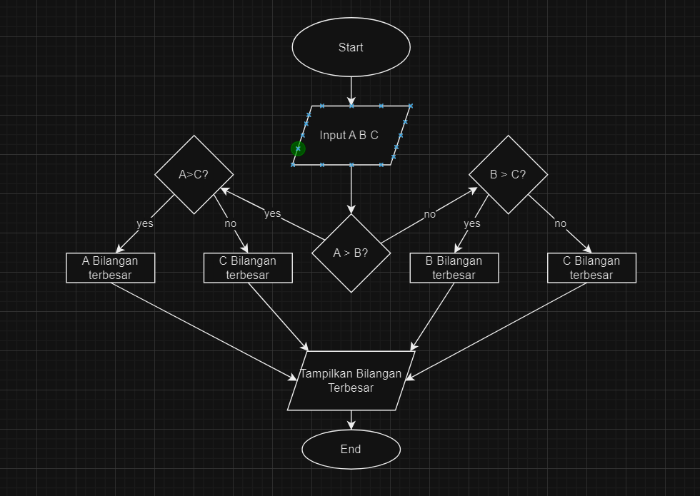

1. Mencari Bilangan Terbesar Dari 3 Bilangan
   Dari program ini kita akan mencari bilangan terbesar dari 3 bilangan

# Flowchart 

# Kode Program

a = int(input("Masukkan bilangan A: "))
b = int(input("Masukkan bilangan B: "))
c = int(input("Masukkan bilangan C: "))

if a > b:
    if a > c:
        print("A adalah terbesar")
        terbesar = a
    else:
        print("C adalah terbesar")
        terbesar = c
else:
    if b > c:
        print("B adalah terbesar")
        terbesar = b
    else:
        print("C adalah terbesar")
        terbesar = c

print(f"Bilangan terbesar adalah: {terbesar}")

# Penjelasan
Program ini menjelaskan bilangan terbesar dari 3 bilangan yang di input oleh user dengan cara:
- inputkan bilangan A, B, C
setelah masukan bilangan kemudian, cek bilangan mana yg memiliki nilai terbesar
- A > B?
  if yes (bilangan terbesar adalah A)
  kemudian A > C
  if yes bilangan terbesar adalah A
  If no (bilangan terbesar adalah c)
  
- B > A?
  if yes (bilangan terbesar adalah B)
  kemudian B > C
  if yes bi;amgan terbesar adalah B
  if no (bilangan terbesar adalah C)

# Hasil Codingan Mencari Bilangan Terbesar 
Masukkan bilangan A: 20
Masukkan bilangan B: 87 
Masukkan bilangan C: 59
B adalah terbesar
Bilangan terbesar adalah: 87

   

